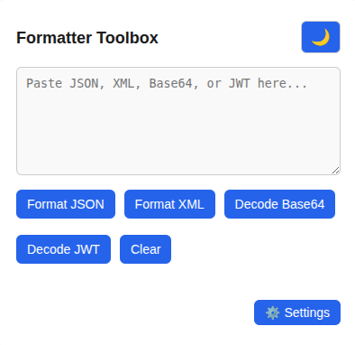
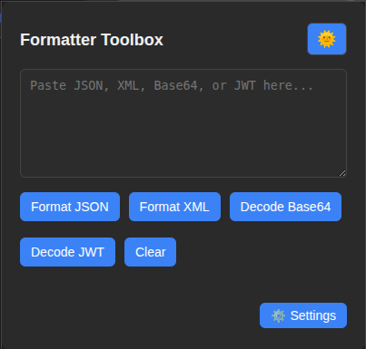
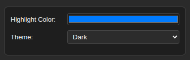

# 🔧 Formatter Toolbox – Chrome Extension

Formatter Toolbox is a simple yet powerful Chrome extension designed to help developers and tech-savvy users format and visualize data like **JSON**, **XML**, **Base64**, and more — right from the browser popup. It includes theme switching (light/dark), syntax highlighting, and easy-to-use UI tools.


---

## 🚀 Features

- ✅ Format and beautify **JSON**
- ✅ Format and highlight **XML**
- ✅ Decode and display **Base64** data
- ✅ Decode and inspect **JWT** tokens
- ✅ Toggle between **Light**, **Dark**, and **Auto** themes
- ✅ Customize highlight color using a visual **color picker**
- ✅ Responsive and modern design
- ✅ One-click copy output
- ✅ Settings panel with live updates

---

## 🖼 Screenshots







---

## 🛠 Installation

### 🧪 Local Development

1. Clone the repository:

   ```bash
   git clone https://github.com/Shasika/formatter_toolbox
